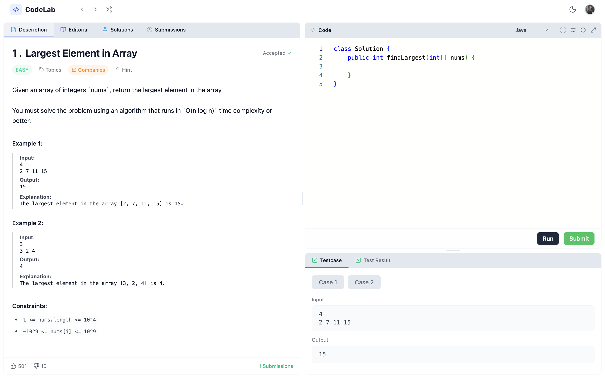
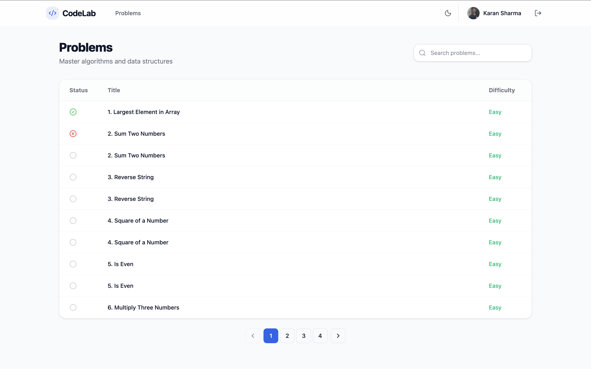
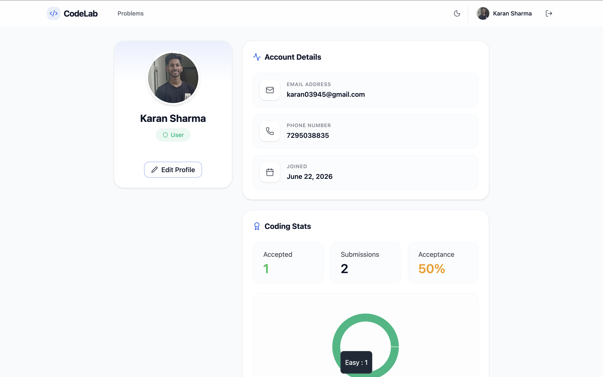
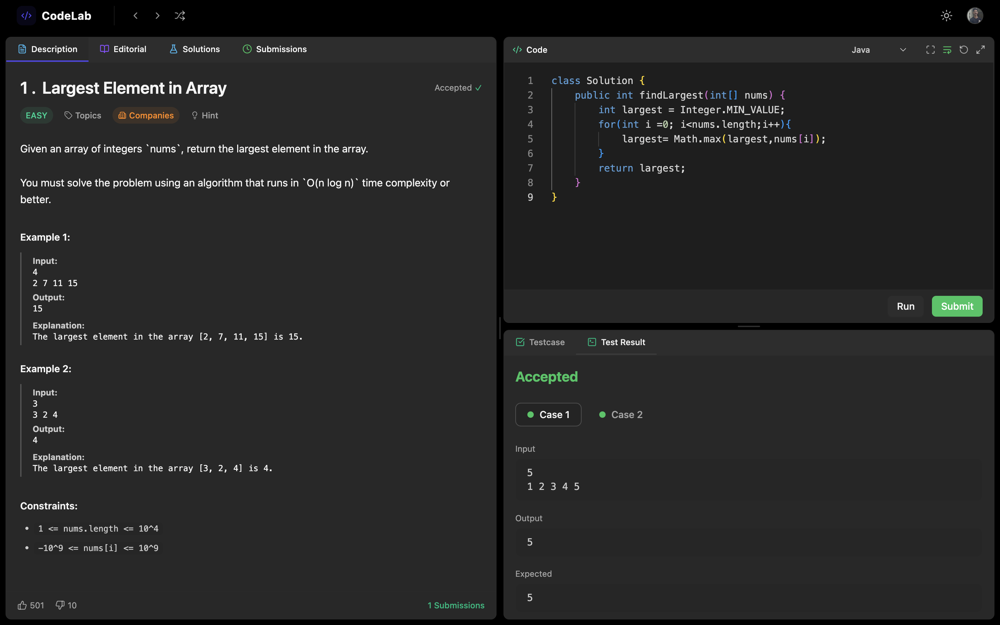
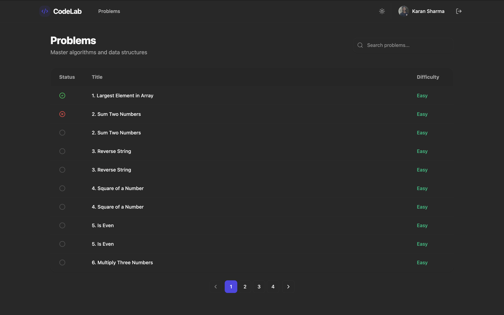
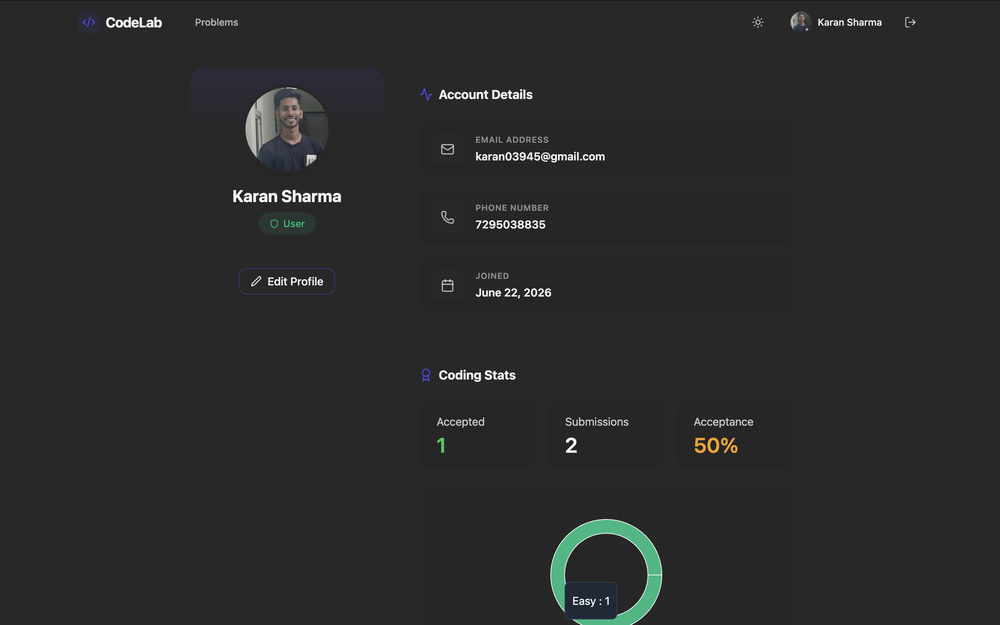

# CodeLab — Code. Solve. Master.

CodeLab is a full-stack web application designed to provide a seamless coding experience, similar to popular coding platforms. Users can write, run, and submit code to solve various programming problems. It supports both light and dark themes to suit your preference.

## 📸 Screenshots

### Light Mode

#### Editor



#### Problem List



#### Profile



### Dark Mode

#### Editor



#### Problem List



#### Profile



## ✨ Features

- **Code Editor**: Built-in Monaco editor supporting multiple languages.
- **Problem List**: Browse, filter, and search through algorithmic problems.
- **Submissions**: Run code against test cases and submit solutions.
- **User Authentication**: Secure signup, login, and password recovery.
- **User Profile**: Track your progress, solved problems, and statistics.
- **Theming**: Toggle between Dark and Light mode for an optimal viewing experience.

## 🛠️ Tech Stack

- **Frontend**: React, Vite, TailwindCSS, Monaco Editor, Zustand, Framer Motion
- **Backend**: Node.js, Express.js, MongoDB (Mongoose), JWT, Cloudinary
- **Containerization**: Docker (for isolated code execution/backend services)

## 🚀 Getting Started

### Prerequisites

- Node.js (v18+)
- MongoDB
- Docker (optional, for code execution environments)

### Installation

1. Clone the repository:

   ```bash
   git clone https://github.com/imksh/CodeLab
   cd CodeLab
   ```

2. Install Client Dependencies:

   ```bash
   cd client
   npm install
   ```

3. Install Server Dependencies:

   ```bash
   cd ../server
   npm install
   ```

4. Environment Variables:
   Create a `.env` file in the `server` directory and configure the necessary variables:

   ```env
   PORT=5000
   MONGO_URI=your_mongodb_connection_string
   JWT_SECRET=your_jwt_secret
   JWT_EXPIRES_IN=7d
   CLOUDINARY_API_KEY=your_cloudinary_api_key
   CLOUDINARY_API_SECRET=your_cloudinary_api_secret
   CLOUDINARY_CLOUD_NAME=your_cloudinary_cloud_name
   EMAIL=your_email
   EMAIL_PASS=your_email_password
   NODE_ENV=development
   ```

5. Start the Application:
   - Start the backend server:
     ```bash
     cd server
     npm run dev
     ```
   - Start the frontend client:
     ```bash
     cd client
     npm run dev
     ```

## 📚 API Documentation

Detailed API documentation can be found in [server/API.md](./server/API.md).

## 🤝 Contributing

Please see the [CONTRIBUTING.md](./CONTRIBUTING.md) file for guidelines on how to contribute to this project.

## 📄 License

This project is licensed under the MIT License. See the [LICENSE](./LICENSE) file for details.
